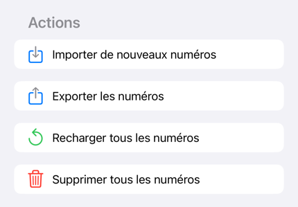

# BEGONE - Blaclisted french phone numbers

## Liste des numéros de téléphone français blacklistés

| Phone number | Desc                                 | Reason                                               | Date       |
|--------------|--------------------------------------|------------------------------------------------------|------------|
| +33 1 62     | ARCEP - Numéros polyvalents vérifiés | Systèmes automatisés d’appels et d’envoi de messages | 05/08/2024 |
| +33 1 63     | ARCEP - Numéros polyvalents vérifiés | Systèmes automatisés d’appels et d’envoi de messages | 05/08/2024 |
| +33 2 70     | ARCEP - Numéros polyvalents vérifiés | Systèmes automatisés d’appels et d’envoi de messages | 05/08/2024 |
| +33 2 71     | ARCEP - Numéros polyvalents vérifiés | Systèmes automatisés d’appels et d’envoi de messages | 05/08/2024 |
| +33 3 77     | ARCEP - Numéros polyvalents vérifiés | Systèmes automatisés d’appels et d’envoi de messages | 05/08/2024 |
| +33 3 78     | ARCEP - Numéros polyvalents vérifiés | Systèmes automatisés d’appels et d’envoi de messages | 05/08/2024 |
| +33 4 24     | ARCEP - Numéros polyvalents vérifiés | Systèmes automatisés d’appels et d’envoi de messages | 05/08/2024 |
| +33 4 25     | ARCEP - Numéros polyvalents vérifiés | Systèmes automatisés d’appels et d’envoi de messages | 05/08/2024 |
| +33 5 68     | ARCEP - Numéros polyvalents vérifiés | Systèmes automatisés d’appels et d’envoi de messages | 05/08/2024 |
| +33 5 69     | ARCEP - Numéros polyvalents vérifiés | Systèmes automatisés d’appels et d’envoi de messages | 05/08/2024 |
| +33 9 48     | ARCEP - Numéros polyvalents vérifiés | Systèmes automatisés d’appels et d’envoi de messages | 05/08/2024 |
| +33 9 49     | ARCEP - Numéros polyvalents vérifiés | Systèmes automatisés d’appels et d’envoi de messages | 05/08/2024 |
| +33 1 88 31  | UBICENTREX                           | Démarchage téléphonique                              | 05/08/2024 |
| +33 1 89 86  | UBICENTREX                           | Démarchage téléphonique                              | 05/08/2024 |
| +33 2 55 42  | UBICENTREX                           | Démarchage téléphonique                              | 05/08/2024 |
| +33 2 58 58  | UBICENTREX                           | Démarchage téléphonique                              | 05/08/2024 |
| +33 3 67 47  | UBICENTREX                           | Démarchage téléphonique                              | 05/08/2024 |
| +33 3 76 44  | UBICENTREX                           | Démarchage téléphonique                              | 05/08/2024 |
| +33 4 12 37  | UBICENTREX                           | Démarchage téléphonique                              | 05/08/2024 |
| +33 4 23 10  | UBICENTREX                           | Démarchage téléphonique                              | 05/08/2024 |
| +33 4 49 45  | UBICENTREX                           | Démarchage téléphonique                              | 05/08/2024 |
| +33 4 51 61  | UBICENTREX                           | Démarchage téléphonique                              | 05/08/2024 |
| +33 5 25 61  | UBICENTREX                           | Démarchage téléphonique                              | 05/08/2024 |
| +33 5 32 92  | UBICENTREX                           | Démarchage téléphonique                              | 05/08/2024 |
| +33 9 72 76  | UBICENTREX                           | Démarchage téléphonique                              | 05/08/2024 |

## Comment utiliser cette liste

Téléchargez le fichier `begone-french-blacklist.xml` et importez-le dans votre application BEGONE pour bloquer les numéros de téléphone identifiés comme indésirables.

# Sources

- ARCEP - Numéros polyvalents vérifiés : [https://www.arcep.fr/la-regulation/grands-dossiers-thematiques-transverses/la-numerotation.html](https://www.arcep.fr/la-regulation/grands-dossiers-thematiques-transverses/la-numerotation.html)